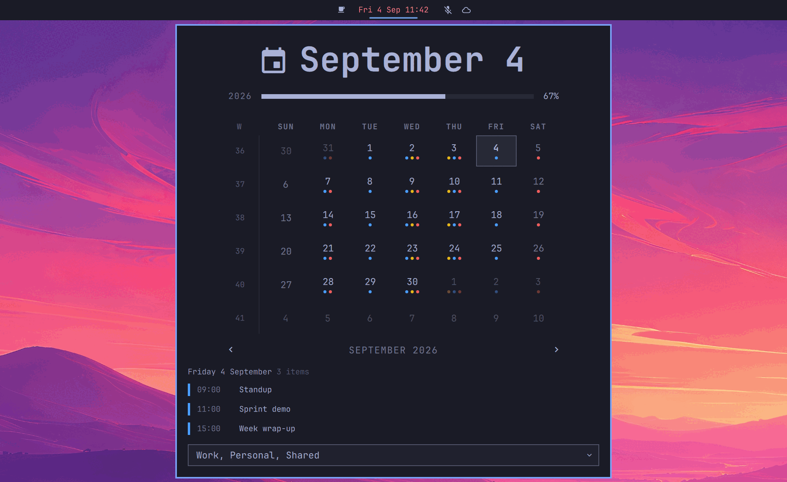
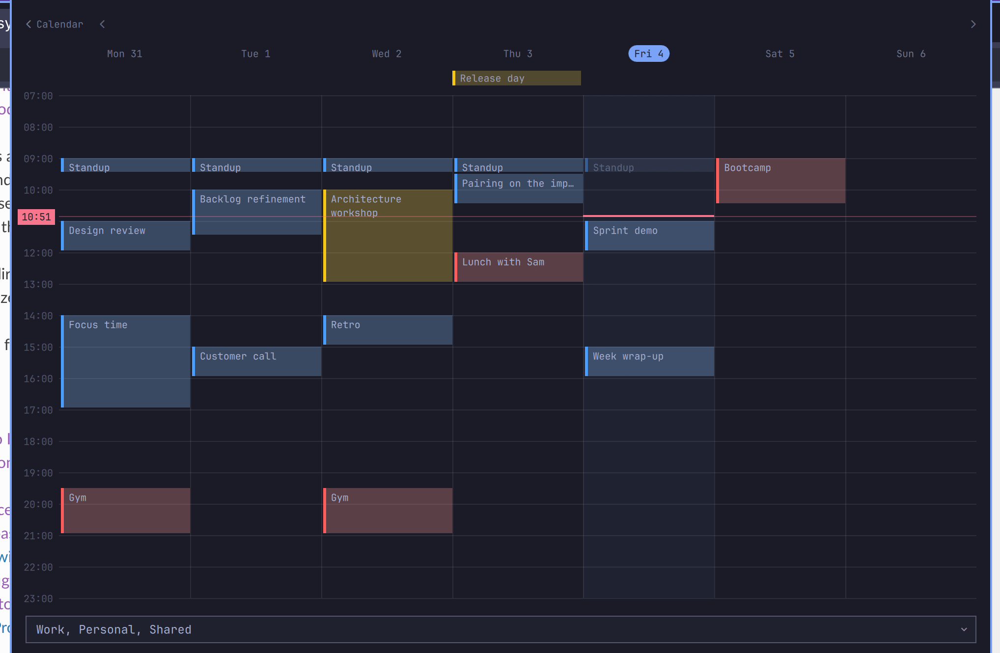
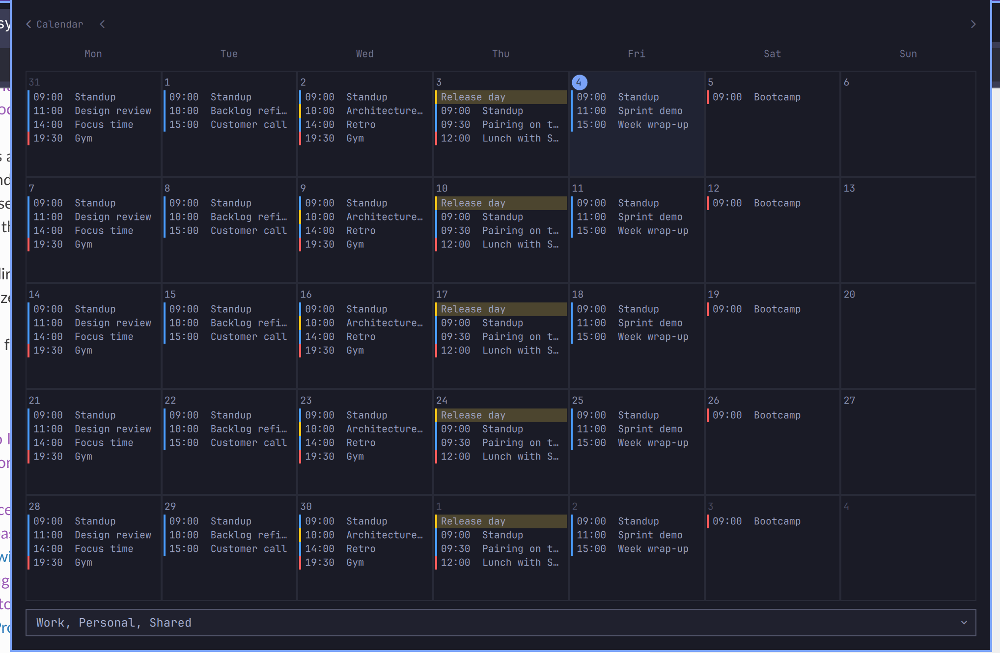
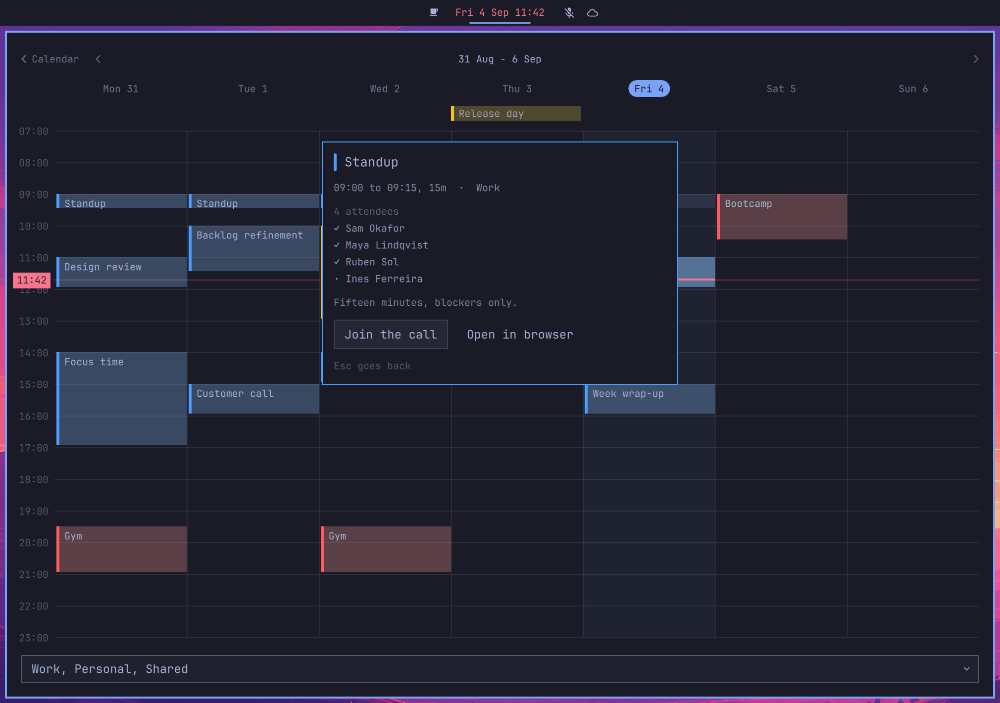

# Clock + Calendar

The Omarchy clock, grown a calendar.

The stock clock popup is a month grid you can only read — today is marked, the
months step, and that is it. This keeps all of that and puts your calendar on
top of it: a row of coloured dots under every day that has something on it, and
the selected day's agenda listed underneath. The week number opens the week as a
timeline; the big date opens the month with its events in it.



The bar label does not change — it is still the clock, still right-click to walk
the formats, still middle-click for the timezone picker. The one addition is a
dot in the meeting's colour when something starts within a quarter of an hour,
and the whole pill colouring in the last five minutes. Everything else lives in
the popup.

The calendars come in over CalDAV — iCloud, Nextcloud, Google, Fastmail, a plain
Radicale — through [vdirsyncer](https://github.com/pimutils/vdirsyncer) and
[khal](https://github.com/pimutils/khal).

## Credits

Two projects made this:

- **[Omarchy](https://omarchy.org)** — the `omarchy.clock` widget is the base.
  The hero date, the year-progress rail, the memento-mori bar, the ISO-week
  gutter, the month grid and its stepping are all from there, unchanged.
- **[jankeesvw/omarchy-meetings](https://github.com/jankeesvw/omarchy-meetings)**
  by Jankees van Woezik — the week timeline, the now line, the gap hatching, the
  join button, the detail card and the demo week. This plugin grew out of a fork
  of it ([omarchy-meetings-caldav](https://github.com/RFdeGroot/omarchy-meetings-caldav)),
  which swapped its Google/gcalcli backend for vdirsyncer + khal. That fork is
  now folded into the clock and retired.

## How it fits together

```
CalDAV (iCloud, Nextcloud, …)  →  vdirsyncer  →  ~/.calendars/<calendar>/*.ics  →  khal  →  this widget
```

`vdirsyncer` keeps a folder of `.ics` files in step with your accounts. `khal`
reads that folder and does the hard parts — expanding recurring events, working
out timezones, splitting multi-day events. The widget writes its own throwaway
khal config, so there is nothing for you to keep in sync between the two.

## Install

```bash
omarchy plugin add https://github.com/RFdeGroot/omarchy-clock-caldav
omarchy plugin enable rfdegroot.clock
~/.config/omarchy/plugins/rfdegroot.clock/bin/clock-anchor set
omarchy restart shell
```

The manifest is `clonedFrom` `omarchy.clock`, so `enable` swaps this plugin into
the bar's clock slot in place of the built-in — same position, same `format`
setting — and `disable` / `remove` puts the built-in back. That part is
automatic.

The one thing the shell does *not* do automatically is `bar.centerAnchor`: it is
matched by literal widget id, not clone-aware, so the last line points it at
`rfdegroot.clock`. (`bin/calendar-setup` runs this for you too.) To hand it back,
`clock-anchor reset` before you disable the plugin.

The two requirements are `vdirsyncer` and `khal`, both in the Arch `extra` repo:

```bash
omarchy pkg add vdirsyncer khal
```

`khal` pulls in the iCalendar parser the attendee lookup uses. (The setup script
below installs these for you if they are missing.)

## Syncing your calendars

Until there are `.ics` files to read, the grid still draws — it is a clock, after
all — and the agenda area hands you the instructions rather than an error.

### The quick way

```bash
~/.config/omarchy/plugins/rfdegroot.clock/bin/calendar-setup
```

It asks which accounts to add (iCloud, Nextcloud, Google), shows the calendars
each one has so you can tick the ones you want, writes `~/.config/vdirsyncer/config`,
does the first sync, and turns on the ten-minute timer.

Run it again and it loads what you already have — it lists your accounts and
their synced calendars, and lets you tick a calendar on or off, add an account,
or remove one, without disturbing the rest. It backs up the config each time.

You still need the credentials ready:

- **iCloud** — an app-specific password from [appleid.apple.com](https://appleid.apple.com)
  → Sign-In and Security → App-Specific Passwords.
- **Nextcloud** — Settings → Security → Devices & sessions → Create new app password.
- **Google** — an OAuth client, not a password. `omarchy pkg add python-aiohttp-oauthlib`,
  then at [console.cloud.google.com](https://console.cloud.google.com): new
  project → enable the **CalDAV API** → Credentials → Create OAuth client ID →
  application type **Desktop app**. First sync opens a browser to authorise.

### Or by hand

Copy the example and fill in the accounts you use:

```bash
cp ~/.config/omarchy/plugins/rfdegroot.clock/vdirsyncer.example.conf ~/.config/vdirsyncer/config
$EDITOR ~/.config/vdirsyncer/config
vdirsyncer discover              # y to each "attempt to create it?" prompt
vdirsyncer sync && vdirsyncer metasync
khal list today 7d               # should now print your events
```

A pair's name has to differ from every storage name — hence the `_sync` suffix
in the example. `collections = ["from b"]` syncs **every** calendar the account
has; to sync only some, list them by the collection id `vdirsyncer discover`
prints. `metadata` carries the calendar names and colours across — but only
`vdirsyncer metasync` moves it, `sync` does not.

Then keep it synced:

```bash
cp ~/.config/omarchy/plugins/rfdegroot.clock/systemd/vdirsyncer.{service,timer} ~/.config/systemd/user/
systemctl --user enable --now vdirsyncer.timer
```

It runs `vdirsyncer sync` then `metasync` every ten minutes. The widget notices
when a sync has written something and re-reads then — otherwise it leaves the
files alone and just ticks its own clock, so it costs almost nothing between
syncs.

### If your vdir root is not `~/.calendars`

Set it in `~/.config/calendar-caldav/config.json` (the config path is shared with
the older standalone plugin, so an existing setup carries straight over):

```json
{ "calendarDir": "~/.local/share/calendars" }
```

## The three faces of the popup

**Calendar** — the default. The stock month grid, with:

- **Event dots** under each day, up to three, one per calendar that has something
  on that day, in that calendar's colour. A faint `+` when there are more.
- **A selected day.** Click any day; its agenda appears under the grid —
  `HH:mm` · colour tick · title, all-day events first, scrollable when long.
  Arrow keys move the selection, `[` / `]` step the month, `t` jumps home.
- **The week number** in the gutter opens that week as a timeline.
- **The big date** opens the month-with-events view.

**Week** — the day-column timeline from the meetings fork: appointments at their
place in time, a line for now with the clock on it, all-day events in a strip
above, overlapping meetings side by side, and the empty space between two of them
hatched with its length named when you point at it.



**Month** — a wall-calendar grid with the events as chips, `+N more` when a day
overflows. Click a day to drop back to the calendar face with it selected.



`‹ Calendar` (or `Esc`) goes back from either.

## One appointment, opened

Click any event — a dot-day's agenda row, a timeline block, a month chip — and it
expands into a card: when it is and how long it runs, which calendar, where, who
is coming and whether they answered, the description. One button joins the video
call (Zoom, Meet, Teams, Jitsi — whatever URL is in the invite); another opens
the event in the browser, or failing that the calendar's own web app. `Esc` goes
back.



Attendees are read straight from the `.ics` on disk, by UID, for the one
appointment you opened and only when you open it.

## Colours

Without a config every calendar is drawn in the colour vdirsyncer pulled from the
server. To override that, or to set an order, write
`~/.config/calendar-caldav/config.json`:

```json
{
  "calendars": [
    { "match": "Work",     "color": "#4a9eff", "priority": 1 },
    { "match": "Personal", "color": "#ff5c5c", "priority": 2 }
  ]
}
```

`match` is a regular expression, tried in order against the calendar's display
name. `priority` decides which appointment the bar's dot picks when two run at
once. A calendar with no rule keeps its server colour.

Optional extras: `"skipCalendars"` (which calendars start unticked in the
picker), `"skipTitles"` (drop appointments by name), `"borrowedCalendar"` (a
toggle that swaps your day for a colleague's), and `"web"` on a rule /
`"webCalendarUrl"` as a catch-all to override the browser target.

## Opening a calendar in the browser

The **Open calendar** button on an appointment with no link of its own opens the
calendar's web app. Which one is worked out **per calendar** from vdirsyncer's
record of where each one syncs from: an iCloud calendar opens `icloud.com/calendar`,
a Nextcloud one that server's `/apps/calendar/`, a Google one `calendar.google.com`.
There is no per-event deep link — iCloud has none — so it drops you in the
calendar, not on the event.

## Trying it without a calendar

```json
{ "demo": true }
```

in `~/.config/calendar-caldav/config.json`, or from the command line without
touching your config:

```bash
~/.config/omarchy/plugins/rfdegroot.clock/bin/calendar-widget week --demo | jq
```

## The command line

```bash
cd ~/.config/omarchy/plugins/rfdegroot.clock/bin
./calendar-widget day             # today as JSON
./calendar-widget week            # Monday through Sunday
./calendar-widget month           # the six-week grid
./calendar-widget calendars       # your calendar names
```

Every appointment carries its start and end, its duration, the calendar, its
colour, its location, its description and its links.

## Removing it

```bash
~/.config/omarchy/plugins/rfdegroot.clock/bin/clock-anchor reset   # centre anchor -> omarchy.clock
omarchy plugin disable rfdegroot.clock                             # the stock clock comes back
omarchy plugin remove rfdegroot.clock
omarchy restart shell
```

`disable` / `remove` restores the built-in `omarchy.clock` to the centre of the
bar with its settings intact; `clock-anchor reset` points the centre anchor back
at it. Do the `reset` first, while this plugin is still installed.

Left behind, yours to delete: `~/.config/calendar-caldav/` (colours, filters,
which calendars you ticked) and `~/.cache/calendar-caldav/` (the generated khal
config and a one-hour cache of calendar names). Your `.ics` files, your
vdirsyncer config and your khal config, if you wrote one, are not this plugin's
to remove.

## Licence

MIT. See [LICENSE](LICENSE).
